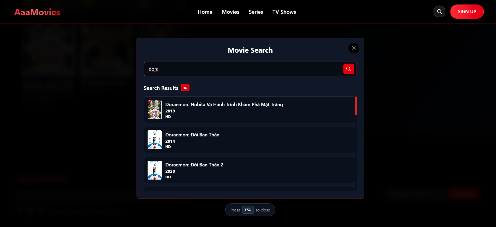

# 🎬 AAA Movies

AAA Movies là một ứng dụng xem phim trực tuyến được xây dựng bằng **ReactJS**, **Vite**, và **TailwindCSS**. Ứng dụng kết nối với backend API đã triển khai sẵn trên **Render**, và được deploy frontend trên **Vercel**.

## 🚀 Demo

- 🌐 Website chính thức: [https://aaa-movies.vercel.app](https://aaa-movies.vercel.app)
- 🛠️ API server: [https://aaamovies.onrender.com/api](https://aaamovies.onrender.com/api)

---

## 🛠️ Công nghệ sử dụng

- ⚛️ ReactJS
- ⚡ Vite (build tool)
- 💨 TailwindCSS (UI utility)
- 🌐 Axios (gọi API)
- 🛠 Render (host backend)
- 🚀 Vercel (host frontend)

---
## 📺 Một số trang



 
## ▶️ Cách chạy dự án local

Yêu cầu: Node.js >= 14

```bash
# Clone project
git clone https://github.com/A3Scotl/AaaMovies.git
cd AaaMovies

# Cài dependencies
npm install

# Chạy project với Vite
npm run dev

🧑‍💻 Tác giả

📧 Email: nguyentruongan0610@gmail.com

🏫 Trường/Đơn vị: [Industrial University of HCM City]


